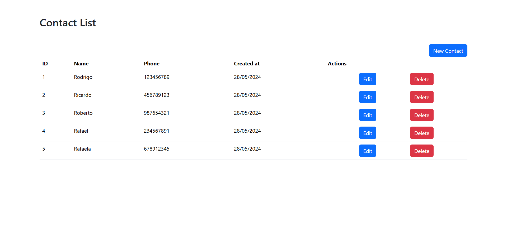
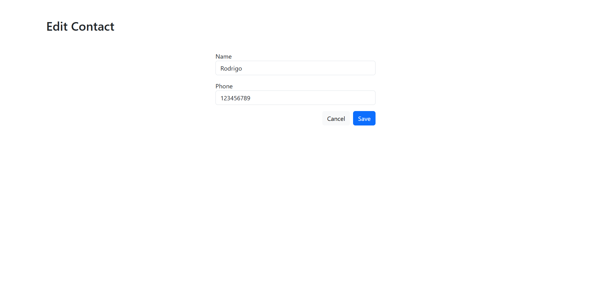
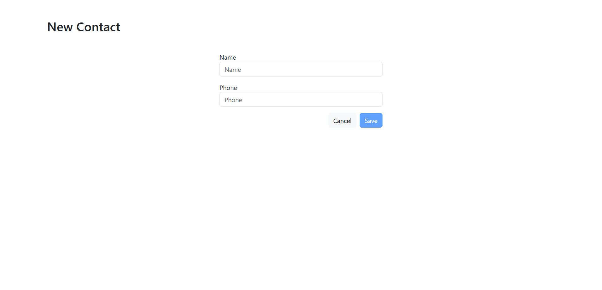

# Phonebook Application

This is a simple CRUD (Create, Read, Update, Delete) application for managing a phonebook using Spring Boot as the backend and Angular as the frontend. The backend uses an in-memory H2 database to store the contact information. The application allows users to list, add, update, and delete contacts with a name and phone number.

## Features

* List all contacts
* Add a new contact
* Update an existing contact
* Delete a contact

## Technologies Used

### Backend

* Spring Boot
* H2 Database
* Spring Data JPA
* Lombok
* Spring Web

### Frontend

* Angular
* Bootstrap

## Installation and Usage

### Prerequisites

* Git

### Installation

To install the project, run the following command:

```bash
git clone https://github.com/WorldChallenge1/phonebook-angular-springboot.git
```

## Backend Installation and Usage

### Prerequisites

* Java Development Kit (JDK) 17 or later

### Starting the Backend

* Move to the project directory

```bash
cd .\phonebook-angular-springboot\Backend\contactsapi\
```

* To start the backend, run the following command:

```bash
./mvnw spring-boot:run
```

## Frontend Installation and Usage

### Prerequisites

* Node.js and npm (Node Package Manager)
* Angular CLI (Angular 17 or later)

### Starting the Frontend

* Move to the project directory

```bash
cd .\phonebook-angular-springboot\Frontend\phonebook-web\
```

* Install dependencies

```bash
npm install
```

* To start the frontend, run the following command:

```bash
ng serve
```

* Go to http://localhost:4200/ to see the application running.

## Screenshots






